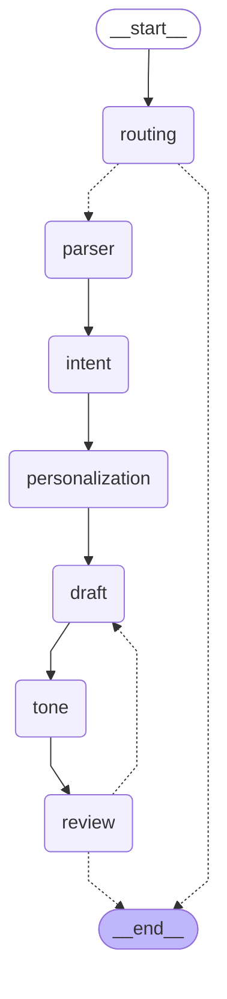

# MailMind 📧🧠

MailMind is an intelligent, multi-agent AI email assistant built with **LangGraph**, **LangChain**, and **Streamlit**. It takes a simple user prompt and automatically drafts, refines, personalizes, and validates professional emails. 

## Table of Contents
- [🏗️ System Architecture](#️-system-architecture)
- [🧩 Components](#-components)
- [🚀 How to Use It](#-how-to-use-it)
- [💻 How to Run Locally](#-how-to-run-locally)
- [🧪 Testing](#-testing)

## 🏗️ System Architecture

MailMind uses a **directed acyclic graph (DAG)** powered by LangGraph to orchestrate a team of specialized AI agents. Data flows through the graph via a shared state (`MailMindState`), ensuring each agent has the context it needs. 

It also includes built-in **OpenAI Moderation** guardrails to ensure user prompts and generated drafts adhere to safety policies.

### The Agent Workflow:



## 🧩 Components

1. **Routing Agent**: The gatekeeper. It checks if the user's prompt is a valid request to write an email and runs an OpenAI Moderation check. Invalid or unsafe requests are immediately rejected.
2. **Input Parser**: Extracts key information, action items, and urgency from the user's raw prompt.
3. **Intent Detector**: Determines the primary goal of the email (e.g., Request, Apology, Update, Inquiry).
4. **Personalization Agent**: Pulls user preferences and recipient guidance from `profiles.json` to tailor the email's context.
5. **Draft Writer**: Takes the parsed intent, key points, and personalized context to generate a structural first draft.
6. **Tone Stylist**: Refines the draft to strictly match the requested tone (Professional, Casual, Urgent, etc.) and injects the sender's unique style and sign-off.
7. **Review Validator**: The quality assurance agent. It reviews the final draft for grammar, coherence, tone alignment, and safety. If the draft fails the review, it is sent back to the Draft Writer for a rewrite (up to 2 retries to prevent infinite loops).

## 🚀 How to Use It

The application features a conversational Streamlit interface where users can:
1. Select a **Tone** from the sidebar.
2. Select a **Recipient Type** (e.g., Boss, Client, Colleague).
3. Chat with the AI by providing short prompts (e.g., *"Tell my boss I'm sick today and will finish the report tomorrow."*).
4. MailMind will process the request through its agent pipeline and display the final email.
5. Users can then **Export** the generated email to a PDF or copy it directly.

## 💻 How to Run Locally

### Prerequisites
- Python 3.9+
- An OpenAI API Key

### Setup Instructions

1. **Clone the repository:**
   ```bash
   git clone https://github.com/smasoudn/MailMind.git
   cd MailMind
   ```

2. **Create and activate a virtual environment:**
   ```bash
   python -m venv venv
   source venv/bin/activate  # On Windows use: venv\Scripts\activate
   ```

3. **Install the dependencies:**
   ```bash
   pip install -r requirements.txt
   ```

4. **Set up your Environment Variables:**
   Create a `.env` file in the root directory and add your OpenAI API key:
   ```env
   OPENAI_API_KEY=your_openai_api_key_here
   ```

5. **Run the Application:**
   ```bash
   streamlit run app.py
   ```
   The Streamlit app will open in your default browser at `http://localhost:8501`.

## 🧪 Testing

MailMind includes a comprehensive unit testing suite using `pytest` and `pytest-mock`. The tests cover all 7 agents and the LangGraph routing logic. By mocking the OpenAI API, the tests run instantly and incur no API costs.

To run the tests locally:

1. **Install the testing dependencies:**
   ```bash
   pip install -r requirements-dev.txt
   ```

2. **Run the test suite:**
   ```bash
   PYTHONPATH=. pytest tests/ -v
   ```