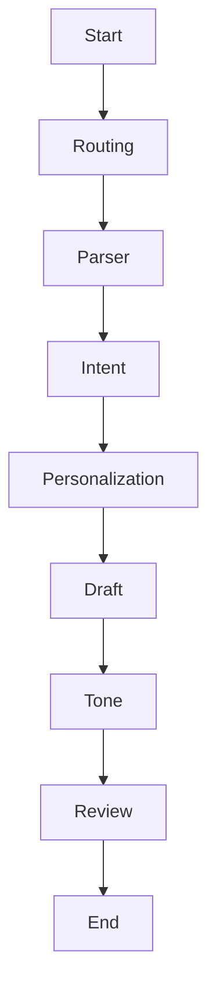

```mermaid
---
config:
  flowchart:
    curve: linear
---
graph TD
	Start["Start"]
	Routing["Routing"]
	Parser["Parser"]
	Intent["Intent"]
	Personalization["Personalization"]
	Draft["Draft"]
	Tone["Tone"]
	Review["Review"]
	End["End"]
	Start --> Routing;
	Routing --> Parser;
	Parser --> Intent;
	Intent --> Personalization;
	Personalization --> Draft;
	Draft --> Tone;
	Tone --> Review;
	Review --> End;
	classDef default fill:#f2f0ff,line-height:1.2
	classDef first fill-opacity:0
	classDef last fill:#bfb6fc
```