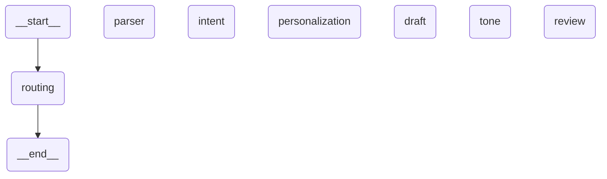
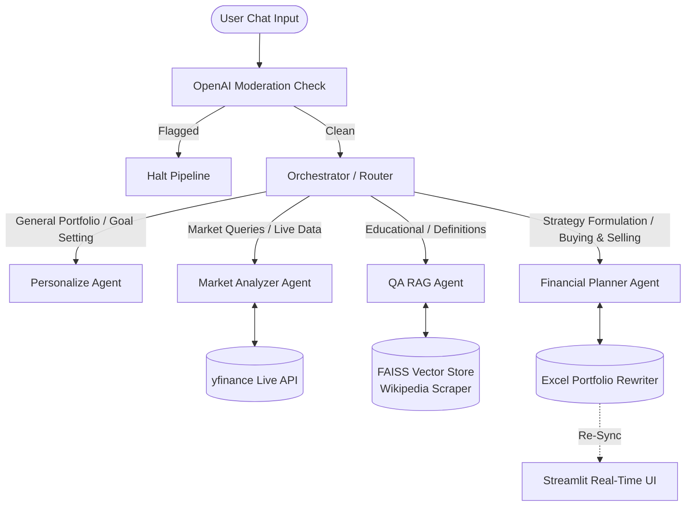

```mermaid
graph TD;
	__start__(<p>__start__</p>)
	routing(routing)
	parser(parser)
	intent(intent)
	personalization(personalization)
	draft(draft)
	tone(tone)
	review(review)
	__end__(<p>__end__</p>)
	__start__ --> routing;
	routing --> __end__;
	classDef default fill:#f2f0ff,line-height:1.2
	classDef first fill-opacity:0
	classDef last fill:#bfb6fc
```

```mermaid
graph TD
    User([User Chat Input]) --> Mod[OpenAI Moderation Check]
    Mod -- "Flagged" --> Reject[Halt Pipeline]
    Mod -- "Clean" --> Supervisor[Orchestrator / Router]
    
    Supervisor -- "General Portfolio / Goal Setting" --> Personalize[Personalize Agent]
    Supervisor -- "Market Queries / Live Data" --> Analyzer[Market Analyzer Agent]
    Supervisor -- "Educational / Definitions" --> QARAG[QA RAG Agent]
    Supervisor -- "Strategy Formulation / Buying & Selling" --> Planner[Financial Planner Agent]

    Analyzer <--> Tools1[(yfinance Live API)]
    QARAG <--> FAISS[(FAISS Vector Store\nWikipedia Scraper)]
    Planner <--> Tools2[(Excel Portfolio Rewriter)]
    
    Tools2 -. "Re-Sync" .-> UI[Streamlit Real-Time UI]
```